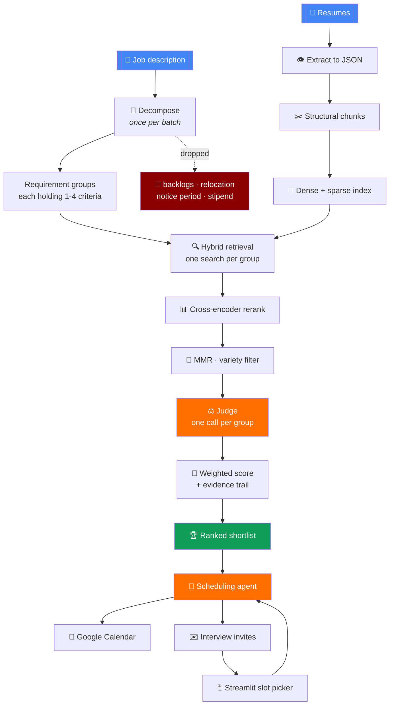
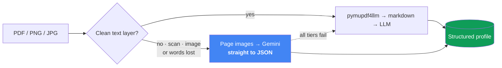
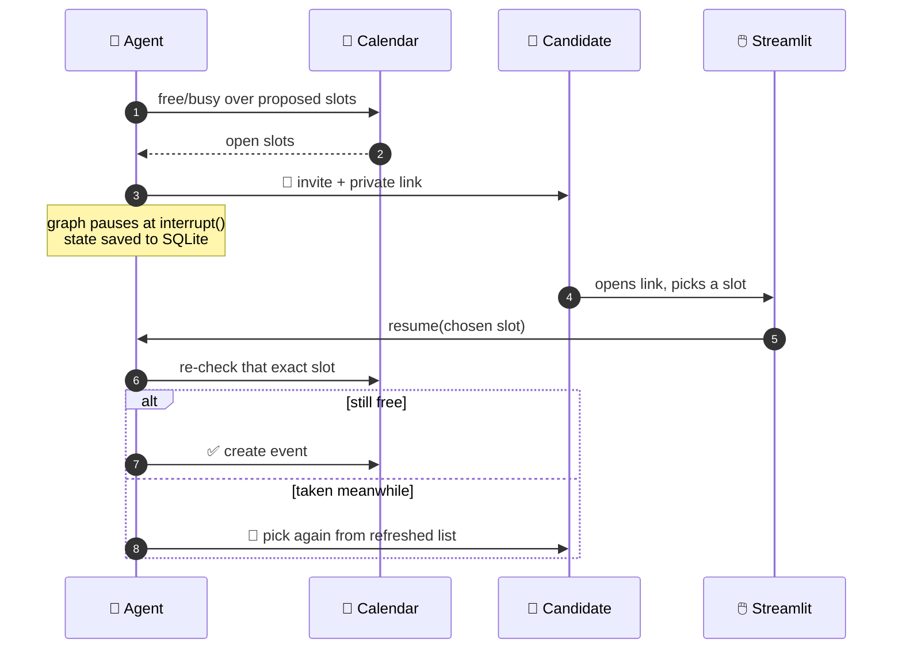

<div align="center">

# 🧭 Resume Screening Agent

**Reads a stack of resumes. Grades each one against a job description with evidence. Books the interviews itself.**

[](https://python.org)
[](https://langchain-ai.github.io/langgraph/)
[](https://ai.google.dev)
[](https://streamlit.io)

*Every score traces back to the exact lines of the resume that produced it.*

</div>

---

## The problem

A recruiter posts one role and gets 200 resumes. Keyword filters throw away good people because they wrote "PyTorch" instead of "deep learning framework". An LLM handed a whole resume and asked "score this out of 100" gives you a number you cannot defend to the candidate you rejected.

This agent does neither. It breaks the job description into individual checkable requirements, retrieves only the resume lines that could answer each one, and asks a model for a verdict **per requirement** — then prints the evidence next to the verdict.

---

## Does it actually work?

Seven resumes, one AI/ML internship JD. The ranking was hand-marked first, then the pipeline ran blind against it.

Candidates are anonymised here — they are real applicants. Labels run in
answer-key order, so Candidate A is the strongest by hand.

| # | Pipeline scored | | Hand-marked answer key |
|:--:|:--|:--:|:--|
| 1 | **Candidate A** · 84.09 | ✅ | Candidate A · 88.64 |
| 2 | **Candidate B** · 75.00 | ✅ | Candidate B · 84.27 |
| 3 | **Candidate C** · 70.00 | ✅ | Candidate C · 82.45 |
| 4 | **Candidate D** · 56.36 | ✅ | Candidate D · 59.82 |
| 5 | **Candidate E** · 27.27 | ✅ | Candidate E · 50.45 |
| 6 | **Candidate F** · 27.27 | ✅ | Candidate F · 34.45 |
| 7 | **Electrical engineer** · 0.00 | ✅ | Electrical engineer · 0.00 |

**All seven positions match the answer key.** The pipeline scores lower than a
human across the board — it only credits what it can find evidence for — but
the *ordering*, which is what a shortlist actually depends on, is identical.

One honest caveat: E and F come out tied at 27.27, so their relative order is
not something the pipeline actually resolved. It happens to agree with the
answer key; on this evidence that is luck, not skill.

The three tests that mattered most:

> 🎯 **The 0.04 test.** The JD demands a minimum CGPA of **8.00**. Candidate C has **7.96** and is strong on nearly every other requirement. The judge marked them `NOT_MET` on CGPA and still placed them third overall on the strength of everything else — the penalty stayed on the one criterion it belonged to instead of sinking the whole application. Reading a table cell correctly and then comparing two decimals is where most naive pipelines quietly fail.
>
> 🎯 **The off-domain test.** A financial planner, a schoolteacher and an electrical design engineer were mixed into the pile. All sank, the electrical engineer to a flat zero. A resume full of the word "analysis" should not float on vibes.
>
> 🎯 **The "named but never used" test.** One candidate lists LangChain and CLIP but has never touched PyTorch, TensorFlow or Keras. They lost that one criterion and kept the rest — instead of being blanket-punished or blanket-credited.

The full answer key was written by hand before the pipeline ever ran — every
criterion, for every candidate, with the reasoning behind each mark. It is kept
out of this repository because it names real candidates and grades them.

---

## How it works



### 1 · Decompose the job description — **once for the whole batch**

The JD is turned into **requirement groups**, each holding one to four atomic criteria. Grouping controls how many *searches* run; it never reduces how many things get *judged*. Three CAD tools that the same resume line would prove become one group with three criteria — one search, three verdicts.

Conditions a resume physically cannot answer — backlogs, relocation, notice period, stipend — are **dropped, not graded**. Marking a candidate `NOT_MET` for not mentioning their notice period is a scoring bug pretending to be rigour. They are reported separately so a human still sees them.

This runs **once**, not once per resume. Decomposing the same JD 25 times to get the same answer 25 times is the single most expensive mistake available here.

### 2 · Extract the resume — vision first, text as backup



Flattening a resume to text destroys the layout, and the layout carries meaning. A CGPA sitting in the CGPA column belongs to the degree on **that row** — markdown loses that, and a text-only model then has to guess. So a vision model reads the page images and emits schema-constrained JSON directly.

Two extras the vision route handles that plain text cannot:

- **Skill sliders.** Some resumes show proficiency as a part-filled bar or a row of dots. The model reads the fill level: `ETAP (advanced, 4/5)`, `Java (beginner, 1/4 bar)`.
- **Footnote markers.** `8.36*` becomes `8.36`, `NSS¹⁰` becomes `NSS`.

The markdown route stays as the fallback, and a word-level check decides which route a given file needs.

### 3 · Chunk by structure, not by character count

The profile is cut along its own seams — `experience`, `education`, `projects`, `technical_skills`, `positions_of_responsibility`, `relevant_courses`, `certifications`, `competitions`. A project keeps its bullets, its technologies and its title together, because splitting every 500 characters would cut a project in half and hand the judge a fragment.

### 4 · Retrieve with two retrievers that disagree

Each group runs **one** search. Dense (`BAAI/bge-small-en-v1.5`) catches meaning, sparse TF-IDF catches exact tokens, and results merge by **Reciprocal Rank Fusion**:

$$\text{score} = \frac{1}{k + \text{rank}}, \quad k = 60$$

`k = 60` deliberately flattens the curve, so *two retrievers agreeing* beats *one retriever being very confident*. It comes from Cormack, Clarke & Büttcher (SIGIR 2009) and is Elasticsearch's default `rank_constant`.

The tokenizer is custom, because the default one silently destroys `C++` and `C#`:

```python
TOKEN_PATTERN = r"(?u)C\+\+|C#|[A-Za-z][A-Za-z0-9+#]*(?:[.-][A-Za-z0-9+#]+)*"
```

### 5 · Rerank, then force variety

A cross-encoder (`ettin-reranker-32m-v1`, sigmoid-activated) reads each shortlisted chunk *together with* the query and reorders them. It is far more accurate than the bi-encoder and far too slow to run over everything, so it only ever sees the top 8.

Then **Maximal Marginal Relevance** picks the final 4:

$$\text{MMR} = \lambda \cdot \text{relevance} - (1-\lambda) \cdot \text{redundancy}, \quad \lambda = 0.8$$

Pure relevance ranking happily returns four near-identical skills lists. MMR trades a little relevance for a different *kind* of evidence — so the judge sees a project **and** an experience entry, not the same sentence four times.

> **Why 4 and not 2:** measured over 8 requirements with known answers, keeping 2 chunks scored 7/8 and keeping 4 scored 8/8. At 2, the weakest model in the pipeline gets the final say.

### 6 · Judge each group, score the batch

One LLM call per group. Every criterion inside it still gets its **own** verdict:

| Verdict | Points |
|:--|--:|
| `MET` | 10.0 |
| `MOSTLY_MET` | 8.0 |
| `PARTIALLY_MET` | 4.5 |
| `NOT_MET` | 0.0 |

`MUST` requirements weigh **1.0**, `NICE` requirements **0.6**. The final score is awarded ÷ possible, as a percentage.

A resume that could not be read scores `None`, **not zero**. Zero means the candidate genuinely lacked everything; putting an unreadable scan at the bottom of a ranking is a fairness bug, not a scoring one.

### 7 · Schedule the interviews



Built on **LangGraph** with a SQLite checkpointer. The graph hits `interrupt()` after sending the email and **stops** — the process can die, and the workflow resumes days later when the candidate clicks their link.

The re-check on the way back matters: two candidates given overlapping options can pick the same slot. The second one is caught and sent back to a refreshed list instead of double-booking.

---

## Setup

### Prerequisites

- Python **3.12**
- A Google account for Calendar and email
- API keys — free tiers are enough

### 1 · Install

```bash
git clone <your-repo-url>
cd agenticAI

python -m venv venv
source venv/bin/activate          # Windows: venv\Scripts\activate

pip install -r requirements.txt
```

> First run downloads the embedding and reranker models (~150 MB) from Hugging Face. That happens once.

### 2 · API keys

> **This repository ships with no credentials and no resumes.** `.env`,
> `credentials.json` and `token.json` are gitignored, and `test_resumes/` is
> empty. You create all of them locally in the steps below — nothing here
> works until you do.

Create a `.env` file in the project root:

```ini
GEMINI_API_KEY=...      # required - resume extraction
CEREBRAS_API_KEY=...    # 1M tokens/day free - the main workhorse
GROQ_API_KEY=...        # fallback tier
EMAIL_ADDRESS=you@gmail.com
PASSWORD=...            # 16-character Gmail App Password, NOT your login password
```

| Key | Where | Free tier |
|:--|:--|:--|
| `GEMINI_API_KEY` | [aistudio.google.com](https://aistudio.google.com/apikey) | generous |
| `CEREBRAS_API_KEY` | [cloud.cerebras.ai](https://cloud.cerebras.ai) | 1M tokens/day |
| `GROQ_API_KEY` | [console.groq.com](https://console.groq.com/keys) | daily token cap |

<details>
<summary><b>⚠️ The email password is not your Google password</b></summary>

Google stopped accepting account passwords over SMTP. You need an **App Password**:

1. Enable 2-Step Verification on the account
2. Go to [myaccount.google.com/apppasswords](https://myaccount.google.com/apppasswords)
3. Generate one — you get 16 characters like `abcd efgh ijkl mnop`
4. Put it in `.env` **with the spaces removed**: `PASSWORD=abcdefghijklmnop`

Without this you get `SMTPAuthenticationError 534: Application-specific password required`.

Verify it before a full run:

```bash
python -c "
import os,smtplib; from dotenv import load_dotenv; load_dotenv()
s=smtplib.SMTP('smtp.gmail.com',587); s.starttls()
s.login(os.getenv('EMAIL_ADDRESS'), os.getenv('PASSWORD')); s.quit()
print('login OK')"
```

</details>

### 3 · Google Calendar access

1. Open [Google Cloud Console](https://console.cloud.google.com) → new project
2. Enable the **Google Calendar API**
3. Credentials → **OAuth client ID** → *Desktop app*
4. Download the JSON, rename it `credentials.json`, drop it in the project root
5. Add your own address as a **test user** on the OAuth consent screen

The first run opens a browser once for consent and writes `token.json`. After that it refreshes silently.

### 4 · Point it at your data

| What | Where |
|:--|:--|
| Job description | `job_description_ai_ml.txt` — or change `JOB_DESCRIPTION_FILE` in `main.py` |
| Resumes | drop PDFs, PNGs or JPGs into `test_resumes/` — it ships empty |
| Who gets emailed | `emails_list` in `main.py` |
| Interview slots | `SLOT_MINUTES`, `SLOT_HOURS`, `SLOT_COUNT` in `google_calender.py` |

**Resumes go in `test_resumes/`.** Create the folder if it is missing, then
drop the files straight in — no subfolders, no naming convention:

```
test_resumes/
├── candidate_one.pdf
├── candidate_two.png
└── scanned_resume.jpg
```

PDFs, PNGs and JPGs all work. Scanned and image-only resumes are fine — they
go through a vision model, not a text extractor. The folder is gitignored on
purpose: resumes are real people's personal data and should not be pushed to a
public repository.

---

## Running it

```bash
python main.py
```

```
13 groups, 13 criteria (decomposed once for the batch)
pymupdf4llm lost 14 words, going straight to JSON from the page images
  profile built directly by gemini flash (direct JSON)
scan detected, going straight to JSON from the page images
  gemini flash (direct JSON) failed (503 UNAVAILABLE), trying next
  profile built directly by gemini flash lite (direct JSON)
...
ranking written to pipeline_ranking.txt (7 scored)
Done - slot selection page is live on http://localhost:8501
```

It grades every resume, writes the ranking, emails the top candidates, then **stays running** to serve the slot-picker page. `Ctrl+C` stops it.

> **Grading only, no emails?** Comment out the last three blocks of `main.py` — the Streamlit launch, `start_candidate_workflows`, and the `wait`.

### What you get

| File | What's in it |
|:--|:--|
| `pipeline_ranking.txt` | 🏆 every candidate ranked, plus the shortlist |
| `test_resumes_verdicts/*_verdict.txt` | name, score, best 2 pieces of evidence per search |
| `test_resumes_verdicts/*_gradesheet.txt` | every criterion, verdict, marks, and which model judged it |
| `test_resumes_verdicts/*_evidence.txt` | full audit trail — every chunk retrieved, kept or dropped, with scores |

---

## Never crash on a rate limit

Every model call sits behind an ordered chain. First one that answers wins. `with_fallbacks` is **stateless**, so it restarts at the top on every call — a model that was exhausted a minute ago is used again the moment it recovers.

| Stage | 1st | 2nd | 3rd | 4th | Last resort |
|:--|:--|:--|:--|:--|:--|
| **Extraction** | Gemini Flash | Flash Lite | Groq Llama-4-Scout | — | PaddleOCR *(local)* |
| **Markdown → JSON** | Cerebras | Groq Llama-3.3-70B | Groq GPT-OSS-120B | Gemini Flash | — |
| **Judging** | Cerebras | Groq GPT-OSS-120B | Groq Llama-3.3-70B | Gemini Flash | Ollama *(local)* |

Anything graded by the local model is flagged **`GRADED BY LOCAL MODEL - MANUAL CHECKING REQUIRED`** in the gradesheet and in the ranking. A small local model is a safety net, not a judge you trust silently.

<details>
<summary><b>A subtle bug worth knowing about</b></summary>

`ChatCerebras` is built on the OpenAI client, so it raises `openai.*` exceptions. `openai.APIStatusError` is **not** a subclass of `groq.APIStatusError` — same name, unrelated classes. Catching only the Groq ones lets a Cerebras 404 or 429 escape the fallback chain and kill the whole run. Both families are caught.

</details>

---

## Project structure

```
├── main.py                      # orchestrates everything
│
├── decompose_JD.py              # JD  →  requirement groups
├── get_data_from_pdf.py         # routing: vision vs markdown
├── build_profile.py             # extraction schema + prompt
├── chunk_resume.py              # structural chunking
│
├── create_chunk_embeddings.py   # dense index
├── retrieval_databases.py       # sparse index + RRF fusion
├── reranking.py                 # cross-encoder
├── mmr.py                       # variety filter
├── build_evidence.py            # retrieval → evidence report
├── generate_score.py            # judging + scoring
├── write_verdict.py             # per-candidate + ranking reports
│
├── agent.py                     # LangGraph scheduling workflow
├── google_calender.py           # calendar + slot generation
├── streamlit_slot_selection.py  # candidate-facing slot picker
│
├── job_description_ai_ml.txt    # the JD being screened against
└── test_resumes/                # put your resumes here (ships empty)
```

Not in the repository, created by you during setup: `.env`,
`credentials.json`, `token.json`, and the resumes themselves.

---

## Design decisions

<details>
<summary><b>Why group requirements instead of batching subqueries?</b></summary>

Batching sends N unrelated questions in one call and hopes the model keeps the evidence straight. Grouping puts requirements that the *same resume lines* would answer into one search — the evidence is genuinely shared, so one call is honest rather than a cost hack. Every criterion still gets its own verdict, so a candidate with AutoCAD but not SolidWorks is recorded as having one and not the other.

</details>

<details>
<summary><b>Why does cosine similarity never drop below ~0.5?</b></summary>

Embedding anisotropy. Every `bge-small` vector leans toward one shared direction (0.667–0.859 against the mean), so even gibberish scores ~0.495 against real text. Raw cosine values are not evidence of anything on their own — which is exactly why ranks, not scores, are fused.

</details>

<details>
<summary><b>Why is a compound requirement a bad requirement?</b></summary>

A criterion demanding *scikit-learn* **and** *regression* **and** *feature engineering* **and** *hyperparameter tuning* forces the judge to confirm four things from four chunks of evidence. It almost never can, so it settles on `PARTIALLY_MET` and a genuinely strong candidate loses marks. One criterion tests one thing; alternatives are joined with **or**.

</details>

<details>
<summary><b>Why is an unreadable resume not a zero?</b></summary>

Zero is a claim about the candidate. `None` is a claim about the file. Collapsing the two puts people at the bottom of a ranking for owning a bad scanner.

</details>

---

## Limitations

- **Scores run 10–25 points below a human marker.** The ordering holds up; the absolute numbers are conservative. Treat it as a ranking tool, not a grading authority.
- **The judge is strict about compound criteria.** Write JD bullets as one requirement each.
- **No parallelism yet.** Resumes are screened one at a time; batching would cut wall-clock time substantially.
- **Bias flagging is not built yet** — the fairness module is the next piece of work.

---

<div align="center">

**Built for Track 01 · Ascendant Agents**

*Every score in this repo can be traced back to the lines of the resume that produced it.*

</div>
